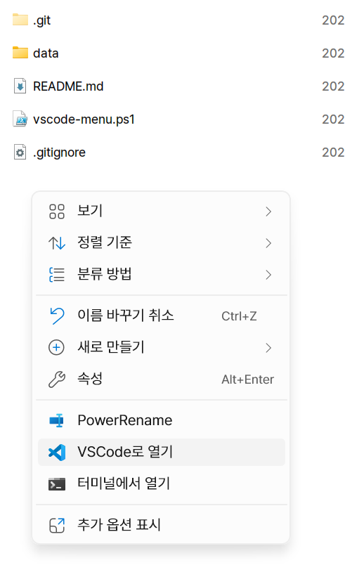

# VSCode-ContextMenu



The powershell script of [VSCode Windows 11 Context Menu](https://github.com/microsoft/vscode/issues/183297#issuecomment-1594350702).

# How to apply
1. Enable `Developer Mode` in `Settings > System > For developers`.

2. [Turn on allow executing unsigned PowerShell scripts](https://www.makeuseof.com/enable-script-execution-policy-windows-powershell/).
```powershell
Set-ExecutionPolicy -Scope CurrentUser -ExecutionPolicy Bypass
```

3. Download `vscode-menu.ps1` from Release and run as PowerShell.

## Change name of context menu
Launch PowerShell script with parameter.
 * Example
```shell
./vscode-menu.ps1 "Open with VSCode Stable"
```